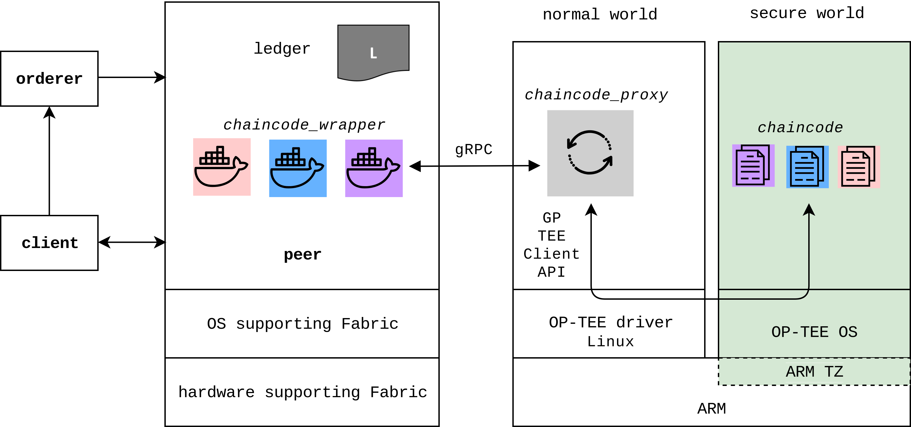
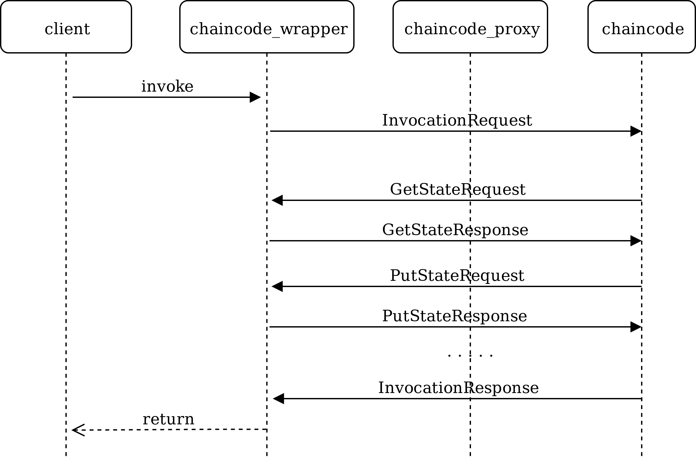

# Hyperledger Fabric chaincode execution with OP-TEE

Fabric OP-TEE Chaincode (FOC) is an architecture and API for Hyperledger Fabric chaincode execution with OP-TEE. The following three subdirectories of this repository contain the implementation of a FOC prototype:

* **chaincode_wrapper** dir:
Contains the so called `chaincode_wrapper`. For each chaincode, a `chaincode_wrapper` gets installed and instantiated at the peer.
Written in go.
* **chaincode_proxy** dir:
Contains the so called `chaincode_proxy` running in the normal world of ARM TZ. 
Written in C++. 
* **chaincode** dir:
Contains a coffee tracking chaincode example which will be loaded and executed in the secure world of ARM TZ whenever a transaction invocation takes place.
The chaincode is actually a TA (Trusted Application). It is written in C.

## Architecture
FOC contains the same type of nodes as Hyperledger Fabric does: we have a client, an orderer and a peer. On the same node as the peer, the chaincode_wrapper is running. Additionally in FOC, we have a node for executing the chaincode (also called chaincode TA) inside the secure world of OP-TEE. This node must support ARM TZ with OP-TEE. The communication between the chaincode_wrapper and the chaincode is handled through the chaincode_proxy in the normal world of OP-TEE.

## API
Each transaction is invoked by the chaincode wrapper with an InvocationRequest and terminated with an InvocationResponse. Between these messages there might be handled as many GetStates and PutStates as needed by the chaincode.

 

## Technologies
Hyperledger Fabric: https://hyperledger-fabric.readthedocs.io/en/release-1.4/

OP-TEE: https://optee.readthedocs.io/

ARM TZ: http://infocenter.arm.com/help/topic/com.arm.doc.prd29-genc-009492c/PRD29-GENC-009492C_trustzone_security_whitepaper.pdf

## Deploy

### chaincode_wrapper
* For the deployment of the `chaincode_wrapper` see: [deployment-wrapper](https://github.com/piachristel/open-source-fabric-optee-chaincode/blob/master/documentation/chaincode-wrapper.md)

### chaincode_proxy and chaincode
* If you want to deploy the `chaincode_proxy` and the `chaincode` emulated with QEMU, see: [deployment-qemu](https://github.com/piachristel/open-source-fabric-optee-chaincode/blob/master/documentation/chaincode-and-chaincode-proxy-qemu.md)
* If you want to deploy the `chaincode_proxy` and the `chaincode` at the Raspberry Pi, see: [deployment-rapi](https://github.com/piachristel/open-source-fabric-optee-chaincode/blob/master/documentation/chaincode-and-chaincode-proxy-rapi.md)

## Run
1. In the UART (normal world) console, login as root and start the `chaincode_proxy` by running `chaincode_proxy`.
2. You can directly invoke commands from the `chaincode_wrapper` at the peer.
